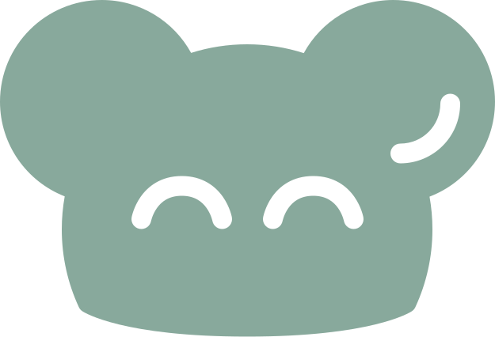
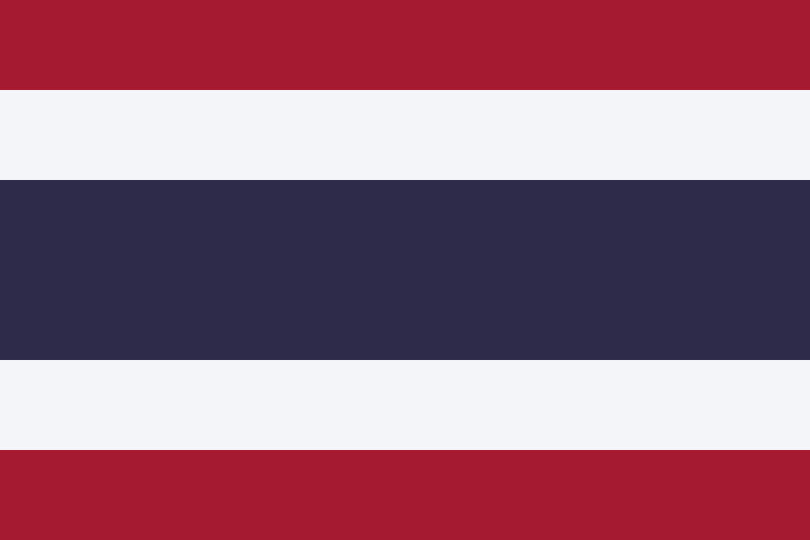

 

# *MAWJI*  

hello there! i'm mawji.

web, game and software developer from  thailand

## *MY PROUD REPOSITORIES* 

-  [**CM.gd**](https://github.com/maji-git/cm-gd) | Multiplayer Framework for Godot
-  [**Polytoria**](https://github.com/Polytoria/polytoria-game/tree/main) | A multiplayer gaming platform built with Godot and .NET *(Former maintainer)*

## *SOCIALS* 

- [X/Twitter ](https://x.com/kunmawji)
- [itch.io ](https://itch.io/)
- [Github](https://github.com/maji-git) << you are here >>